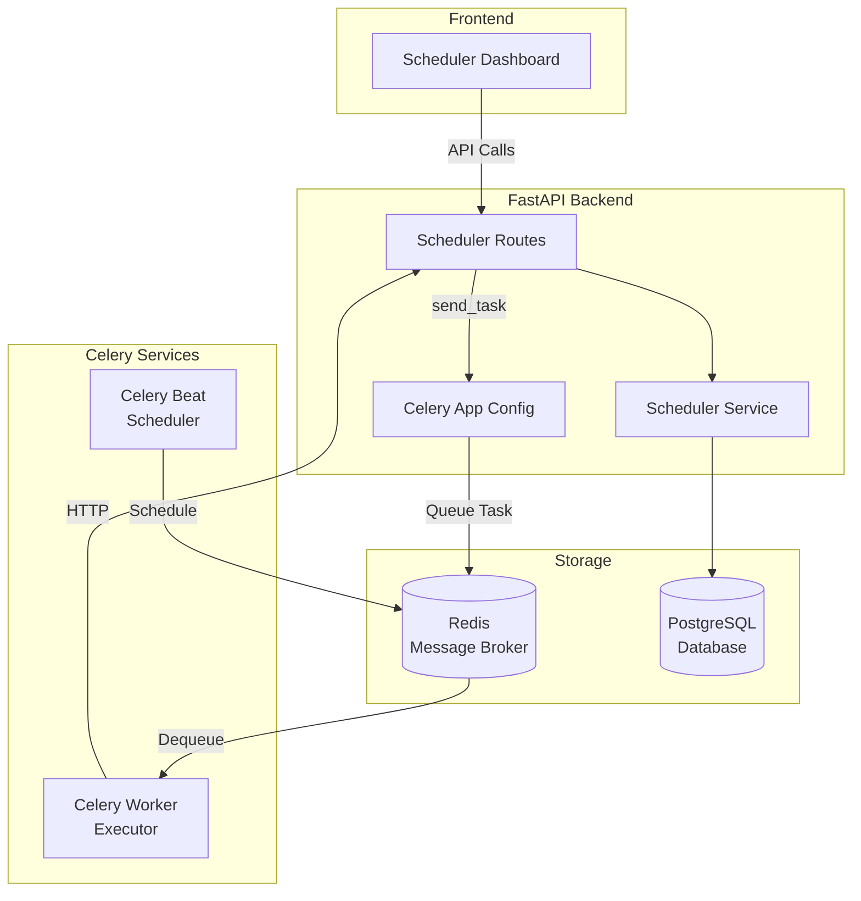
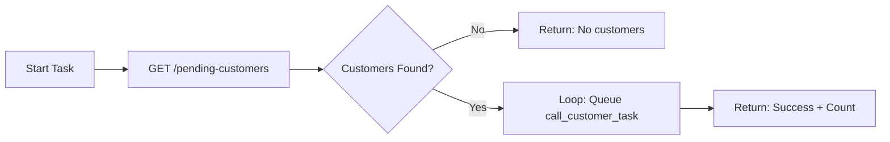
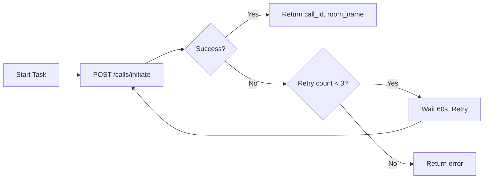
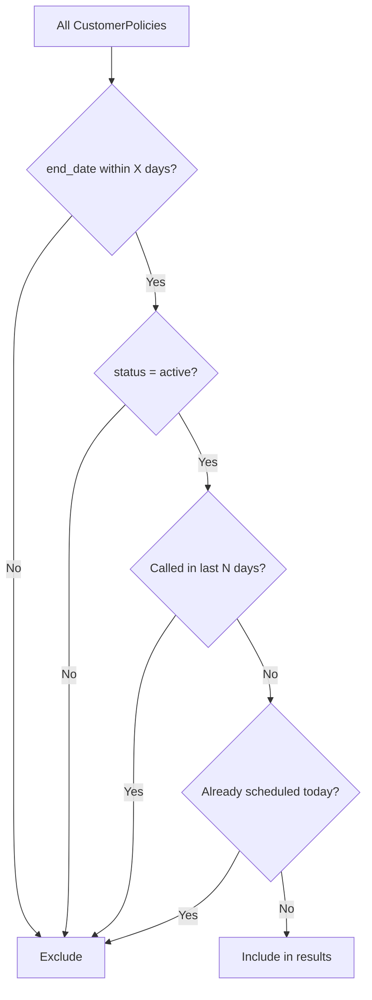
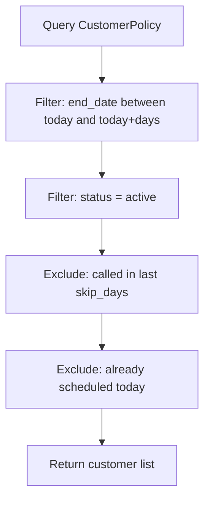
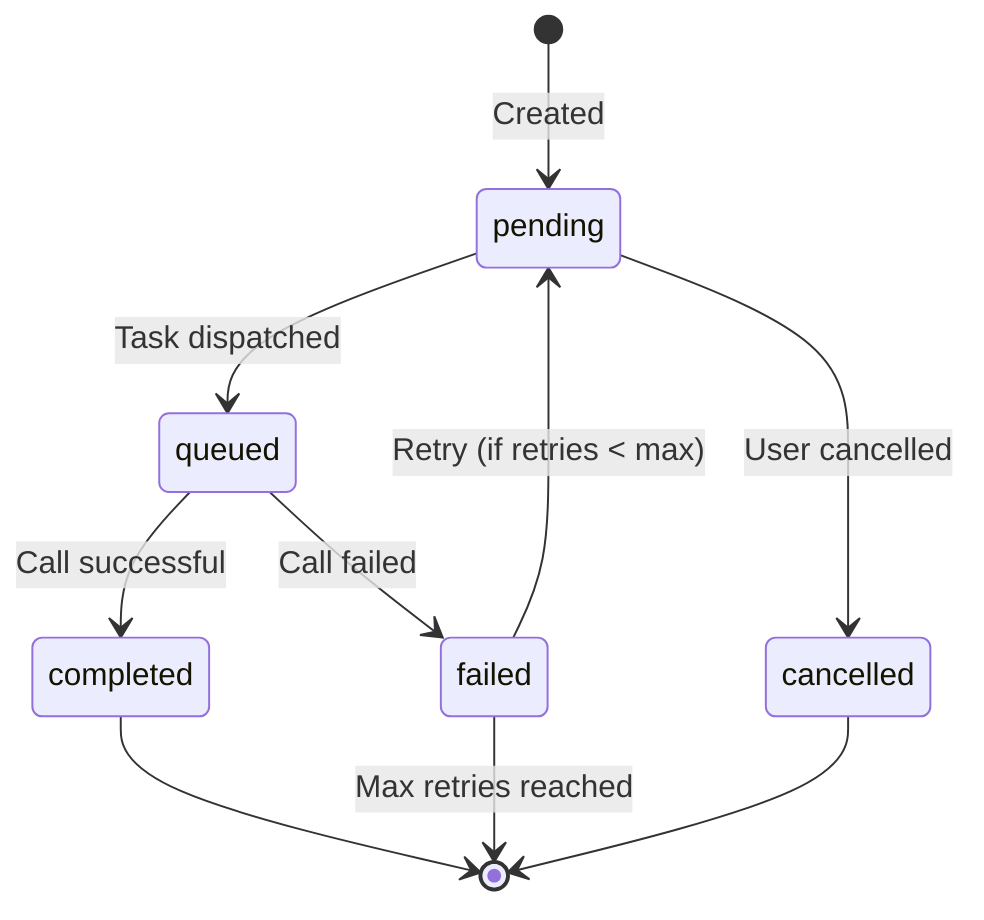
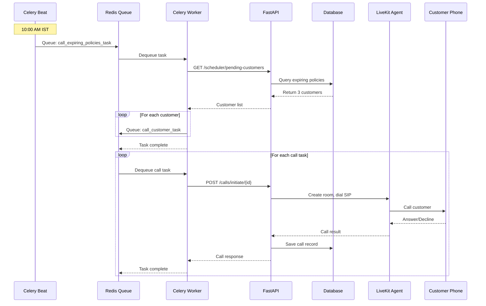
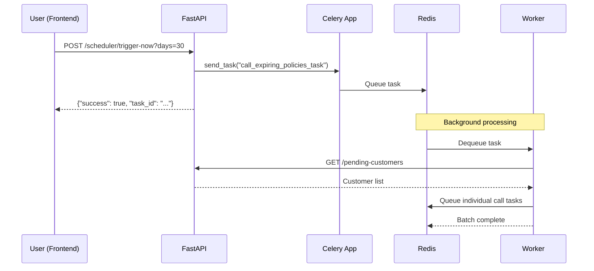
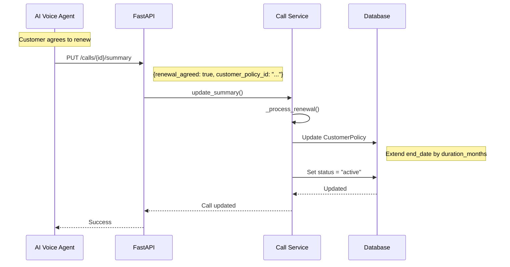

# Auto-Scheduling System Documentation

Complete technical documentation for the Celery + Redis background task system.

---

## Table of Contents

1. [Architecture Overview](#architecture-overview)
2. [Components](#components)
3. [Celery Tasks](#celery-tasks)
4. [API Endpoints](#api-endpoints)
5. [Service Functions](#service-functions)
6. [Database Models](#database-models)
7. [Docker Configuration](#docker-configuration)
8. [Flow Diagrams](#flow-diagrams)

---

## Architecture Overview



---

## Components

### File Structure

```
backend/app/
├── core/
│   └── celery_app.py          # Celery configuration
├── tasks/
│   └── scheduler.py           # Background tasks
├── routes/
│   └── scheduler.py           # API endpoints
├── services/
│   └── scheduler_service.py   # Business logic
├── models/
│   └── scheduled_call.py      # Database models
└── schemas/
    └── scheduler.py           # Pydantic schemas
```

---

## Celery Tasks

### File: `backend/app/tasks/scheduler.py`

#### 1. `call_expiring_policies_task`

**Purpose:** Daily batch task to call customers with expiring policies.

```python
@shared_task(bind=True)
def call_expiring_policies_task(self, days_before_expiry: int = 30, max_calls: int = 20)
```

| Parameter | Type | Default | Description |
|-----------|------|---------|-------------|
| days_before_expiry | int | 30 | Days before expiry to start calling |
| max_calls | int | 20 | Maximum calls per batch |

**Flow:**


**Returns:**
```json
{
  "success": true,
  "total": 5,
  "called": 5,
  "results": [{"customer_id": "...", "status": "queued"}]
}
```

---

#### 2. `call_customer_task`

**Purpose:** Call a single customer via the API.

```python
@shared_task(bind=True, max_retries=3)
def call_customer_task(self, customer_id: str, reason: str = "expiring_policy")
```

| Parameter | Type | Default | Description |
|-----------|------|---------|-------------|
| customer_id | str | required | Customer UUID |
| reason | str | "expiring_policy" | Call reason (expiring_policy, follow_up, manual) |

**Flow:**


**Returns:**
```json
{
  "success": true,
  "customer_id": "uuid",
  "call_id": "uuid",
  "room_name": "insurance_call:+91xxx"
}
```

---

#### 3. `cleanup_old_scheduled_calls`

**Purpose:** Remove old scheduled call records.

```python
@shared_task
def cleanup_old_scheduled_calls(days: int = 30)
```

| Parameter | Type | Default | Description |
|-----------|------|---------|-------------|
| days | int | 30 | Delete records older than X days |

---

## API Endpoints

### File: `backend/app/routes/scheduler.py`

| Method | Endpoint | Description |
|--------|----------|-------------|
| GET | `/api/scheduler/config` | Get scheduler configuration |
| PUT | `/api/scheduler/config` | Update scheduler configuration |
| GET | `/api/scheduler/pending-customers` | Get customers to call |
| GET | `/api/scheduler/scheduled-calls` | List scheduled calls |
| POST | `/api/scheduler/scheduled-calls` | Create scheduled call |
| DELETE | `/api/scheduler/scheduled-calls/{id}` | Cancel scheduled call |
| GET | `/api/scheduler/stats` | Get today's statistics |
| POST | `/api/scheduler/trigger-now` | Trigger scheduler immediately |
| DELETE | `/api/scheduler/cleanup` | Clean old records |

---

### Endpoint Details

#### GET `/api/scheduler/config`

Returns current scheduler configuration.

**Response:**
```json
{
  "enabled": true,
  "daily_call_time": "10:00",
  "days_before_expiry": 30,
  "max_calls_per_day": 50,
  "skip_if_called_within_days": 7
}
```

---

#### PUT `/api/scheduler/config`

Update scheduler settings.

**Request Body:**
```json
{
  "enabled": true,
  "daily_call_time": "11:00",
  "days_before_expiry": 14,
  "max_calls_per_day": 100
}
```

---

#### GET `/api/scheduler/pending-customers`

Get customers eligible for calls.

**Query Parameters:**
| Param | Type | Default | Description |
|-------|------|---------|-------------|
| days | int | 30 | Expiry window |
| limit | int | 50 | Max results |

**Response:**
```json
{
  "count": 3,
  "customers": [
    {
      "customer_id": "uuid",
      "customer_name": "John Doe",
      "customer_phone": "+919123456789",
      "policy_name": "Health Plus",
      "policy_end_date": "2025-01-15",
      "days_to_expiry": 10
    }
  ]
}
```

**Filtering Logic:**


---

#### POST `/api/scheduler/trigger-now`

Manually trigger the scheduler.

**Query Parameters:**
| Param | Type | Default | Description |
|-------|------|---------|-------------|
| days | int | 30 | Expiry window |
| max_calls | int | 20 | Max calls |

**Implementation:**
```python
# Uses send_task (not import) to avoid connection issues
task = celery_app.send_task(
    "backend.app.tasks.scheduler.call_expiring_policies_task",
    args=[days, max_calls]
)
```

**Response:**
```json
{
  "success": true,
  "message": "Scheduler triggered for 30 days expiry window",
  "task_id": "uuid",
  "queued_count": 20
}
```

---

## Service Functions

### File: `backend/app/services/scheduler_service.py`

#### Configuration Functions

| Function | Description |
|----------|-------------|
| `get_scheduler_config(session)` | Get or create config |
| `update_scheduler_config(session, data)` | Update config settings |

---

#### Customer Query Functions

##### `get_pending_customers(session, days, limit)`



**SQL Logic:**
```sql
SELECT cp.*, c.name, c.phone, p.name as policy_name
FROM customer_policies cp
JOIN customers c ON cp.customer_id = c.id
JOIN policies p ON cp.policy_id = p.id
WHERE cp.end_date BETWEEN :today AND :today + :days
  AND cp.status = 'active'
  AND c.id NOT IN (
    SELECT customer_id FROM calls 
    WHERE started_at > :today - :skip_days
  )
  AND c.id NOT IN (
    SELECT customer_id FROM scheduled_calls
    WHERE scheduled_date = :today 
    AND status IN ('pending', 'queued')
  )
LIMIT :limit
```

---

#### Scheduled Call Functions

| Function | Description |
|----------|-------------|
| `get_scheduled_calls(session, date, status, customer_id, limit)` | List with filters |
| `create_scheduled_call(session, data)` | Create new entry |
| `cancel_scheduled_call(session, scheduled_call_id)` | Set status to cancelled |
| `cleanup_old_scheduled_calls(session, days)` | Delete old records |

---

#### Statistics Function

##### `get_scheduler_stats(session)`

**Response:**
```json
{
  "today": "2025-12-05",
  "scheduled_today": 10,
  "completed_today": 5,
  "failed_today": 1,
  "pending_today": 4,
  "total_pending": 15,
  "next_scheduled_time": "10:00",
  "scheduler_enabled": true
}
```

---

## Database Models

### File: `backend/app/models/scheduled_call.py`

#### SchedulerConfig

```python
class SchedulerConfig(SQLModel, table=True):
    id: str                          # UUID, singleton
    enabled: bool = True             # On/off switch
    daily_call_time: str = "10:00"   # When to run
    days_before_expiry: int = 30     # Call X days before
    max_calls_per_day: int = 50      # Daily limit
    max_concurrent_calls: int = 5    # Parallel limit
    retry_failed_after_hours: int = 24
    max_retries_per_customer: int = 3
    skip_if_called_within_days: int = 7
    updated_at: datetime
```

---

#### ScheduledCall

```python
class ScheduledCall(SQLModel, table=True):
    id: str                          # UUID
    customer_id: str                 # FK to customers
    customer_policy_id: Optional[str] # FK to customer_policies
    scheduled_date: date             # When to call
    scheduled_time: Optional[str]    # Specific time
    status: str                      # pending|queued|completed|failed|cancelled
    reason: str                      # expiring_policy|follow_up|manual
    priority: int = 0                # Higher = first
    celery_task_id: Optional[str]    # Task reference
    call_id: Optional[str]           # Resulting call
    notes: Optional[str]
    retry_count: int = 0
    created_at: datetime
    executed_at: Optional[datetime]
```

**Status Flow:**


---

## Docker Configuration

### File: `docker-compose.yml`

```yaml
services:
  # Redis - Message Broker
  redis:
    image: redis:alpine
    ports:
      - "6379:6379"
    healthcheck:
      test: ["CMD", "redis-cli", "ping"]
      interval: 5s
      timeout: 3s
      retries: 5

  # Celery Worker - Task Executor
  celery_worker:
    build: .
    command: celery -A backend.app.core.celery_app worker --loglevel=info
    environment:
      - REDIS_URL=redis://redis:6379/0
      - DATABASE_URL=postgresql+asyncpg://postgres:postgres@db:5432/insurance_db
    depends_on:
      redis:
        condition: service_healthy
      db:
        condition: service_healthy

  # Celery Beat - Scheduler
  celery_beat:
    build: .
    command: celery -A backend.app.core.celery_app beat --loglevel=info
    environment:
      - REDIS_URL=redis://redis:6379/0
    depends_on:
      redis:
        condition: service_healthy
```

---

## Flow Diagrams

### Daily Automatic Call Flow (10:00 AM)



---

### Manual Trigger Flow



---

### Renewal Agreement Flow



---

## Environment Variables

| Variable | Default | Description |
|----------|---------|-------------|
| `REDIS_URL` | `redis://redis:6379/0` | Redis connection string |
| `DATABASE_URL` | - | PostgreSQL connection |

---

## Celery App Configuration

### File: `backend/app/core/celery_app.py`

```python
celery_app = Celery(
    "insurance_scheduler",
    broker=REDIS_URL,
    backend=REDIS_URL,
    include=["backend.app.tasks.scheduler"]
)

celery_app.conf.update(
    task_serializer="json",
    timezone="Asia/Kolkata",
    enable_utc=True,
    result_expires=3600,
    
    beat_schedule={
        "call-expiring-policies-daily": {
            "task": "backend.app.tasks.scheduler.call_expiring_policies_task",
            "schedule": crontab(hour=10, minute=0),  # 10:00 AM IST
        },
    },
)
```

---

## Quick Reference

### Start Services
```bash
docker compose up -d
```

### View Worker Logs
```bash
docker logs insurance_celery_worker -f
```

### Trigger Scheduler Manually
```bash
curl -X POST "http://localhost:8000/api/scheduler/trigger-now?days=30&max_calls=10"
```

### Check Stats
```bash
curl http://localhost:8000/api/scheduler/stats
```
